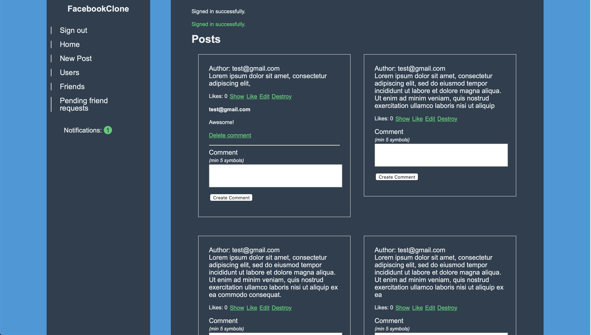

# PROJECT: FACEBOOK CLONE from Microverse
This is a clone of Facebook social network built with Ruby and Ruby on Rails. You are able to add posts, comments, like posts and add\remove friends.

From the Microverse Ruby on rails curriculum

Link to Heroku: https://floating-wave-46859.herokuapp.com/

Following [this link](https://www.theodinproject.com/courses/ruby-on-rails/lessons/final-project) from The Odin Project 

This project will give you a chance to take a relatively high level set of requirements and turn it into a functioning website. You’ll need to read through the documentation on Github for some of the gems you’ll be using.

## Log in information
Email: test@gmail.com or test2@gmail.com
Password: 12345678

## Installation
1. git clone https://github.com/webmarkyn/facebook-clone.git
2. cd facebook-clone
3. bundle install
4. rails server  

## Testing
In project root folder run `bundle exec rspec spec`

## Authors

👤 **Mark Baidebura**

- Github: [@webmarkyn](https://github.com/webmarkyn)
- Linkedin: [linkedin](https://www.linkedin.com/in/mark-baidebura/)
- Twitter: [@webmarkyn](https://twitter.com/webmarkyn)

👤 **Andres Rodriguez**
- Github: [@andynarf](https://github.com/andynarf)
- Linkedin: [linkedin](https://www.linkedin.com/in/andres-dev/)

## 🤝 Contributing

Contributions, issues and feature requests are welcome!

Feel free to check the [issues page](https://github.com/webmarkyn/facebook-clone/issues).

## Show your support

Give a ⭐️ if you like this project!
